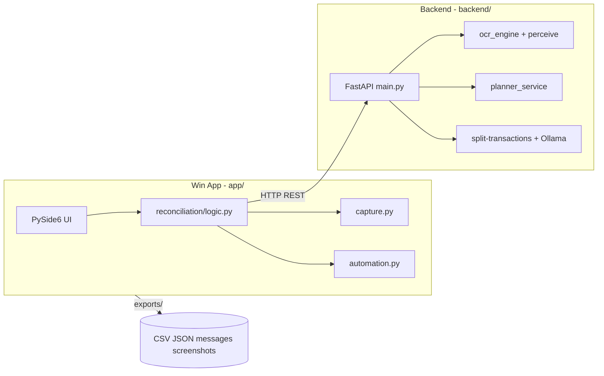
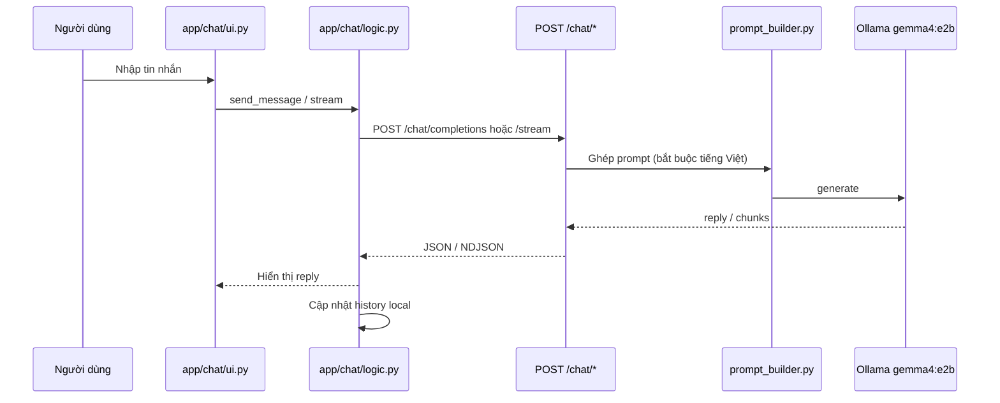
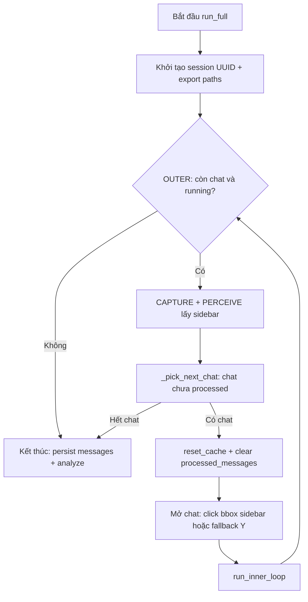
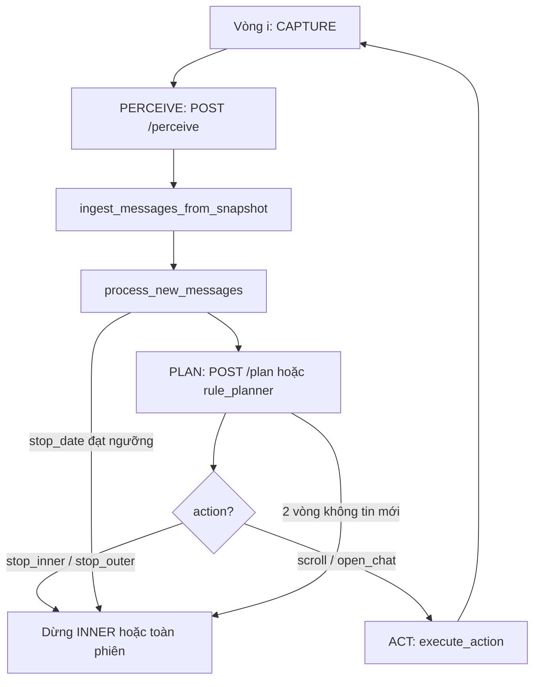
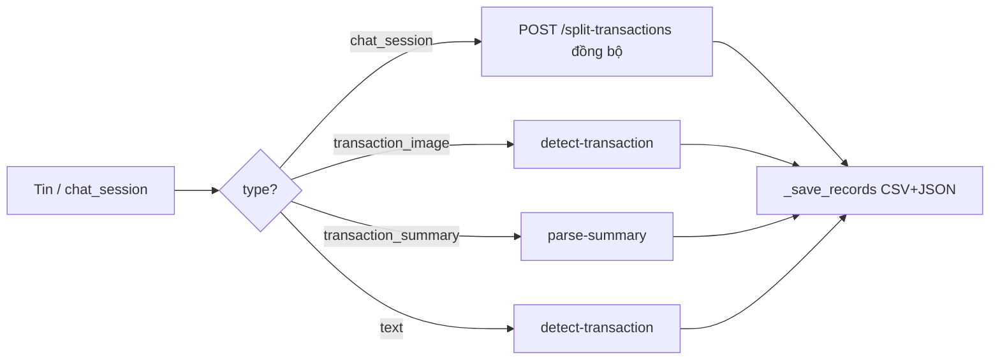
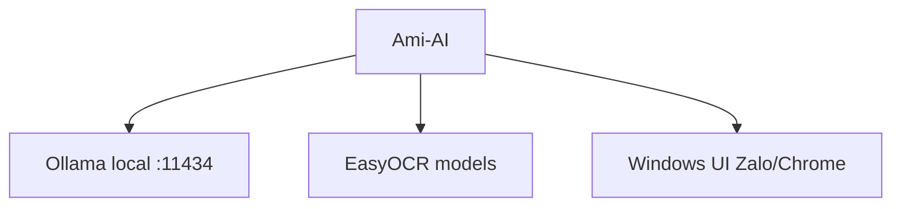

# Luồng hệ thống Ami-AI

> Tài liệu mô tả kiến trúc và luồng xử lý end-to-end.  
> Chi tiết spec đối soát: [markdown.md](markdown.md) · Cấu trúc thư mục: [PROJECT_STRUCTURE.md](PROJECT_STRUCTURE.md)

---

## 1. Tổng quan

Ami-AI gồm **hai tiến trình** chạy song song trên Windows:

| Tiến trình | Công nghệ | Vai trò |
|-----------|-----------|---------|
| **Win App** (`app/`) | PySide6 | UI, chụp màn hình, automation (scroll/click), export local |
| **Backend** (`backend/`) | FastAPI + uvicorn | OCR, planner, Ollama (split-transactions), phân tích giao dịch |

Hai module nghiệp vụ độc lập trong cùng một ứng dụng:

1. **Chat AI** — trò chuyện với Ollama (`gemma4:e2b`), luôn trả lời tiếng Việt.
2. **Đối soát kế toán (Reconciliation)** — tự động đọc lịch sử chat, OCR, trích giao dịch, xuất CSV/JSON.



**Chạy:**

```powershell
# Terminal 1
.\run_backend.ps1    # http://127.0.0.1:8000

# Terminal 2
.\run_app.ps1        # PySide6 + auto-reload
```

Client kiểm tra backend qua `GET /health` (`app/shared/api_client.py`).

---

## 2. Luồng module Chat AI

### 2.1 Sơ đồ



### 2.2 Các bước

1. Tab **Chat AI** (`app/chat/ui.py`) nhận input người dùng.
2. `ChatLogic` (`app/chat/logic.py`) gửi `message` + `history` lên backend.
3. Backend (`backend/chat/router.py`):
   - `/chat/completions` — trả reply một lần.
   - `/chat/stream` — NDJSON từng chunk (`{"chunk": "..."}`, kết thúc `{"done": true}`).
4. `prompt_builder.py` bọc prompt; `ollama_client.py` gọi Ollama tại `OLLAMA_BASE_URL` (mặc định `http://127.0.0.1:11434`).
5. Lịch sử hội thoại chỉ lưu **phía client**; backend stateless theo từng request.

---

## 3. Luồng module Đối soát (Reconciliation)

Đây là luồng chính: automation đọc chat Zalo PC / Chrome (Messenger), trích giao dịch, xuất file.

### 3.1 Kiến trúc phân tầng

```text
┌─────────────────────────────────────────────────────────────────┐
│  UI (app/reconciliation/ui.py)                                   │
│  - Cấu hình: stop_date, app chụp, max_chats                      │
│  - Worker QThread: run_full | run_chat_segment | perceive_once   │
└────────────────────────────┬────────────────────────────────────┘
                             │
┌────────────────────────────▼────────────────────────────────────┐
│  ReconciliationLogic (app/reconciliation/logic.py)               │
│  FSM: CAPTURE → PERCEIVE → (xử lý tin) → PLAN → ACT              │
│  OUTER LOOP (nhiều chat) / INNER LOOP (một chat)                 │
└─────┬──────────────────┬──────────────────┬─────────────────────┘
      │ capture            │ HTTP API          │ automation
      ▼                    ▼                   ▼
 capture.py          api_client.py      automation.py
 (Zalo/Chrome)       /reconciliation/*   scroll, click bbox
```

### 3.2 Hai chế độ chạy

| Chế độ | Nút UI | Hàm | Mô tả |
|--------|--------|-----|--------|
| **Đối soát đầy đủ** | Bắt đầu đối soát | `run_full()` | OUTER: tối đa `max_chats` hội thoại sidebar → mỗi chat một INNER |
| **Quét đoạn** | Quét đoạn chat | `run_chat_segment()` | Chỉ INNER trên chat đang mở; không đổi sidebar; `max_iterations=None` |

Cả hai đều dùng chung vòng **INNER**; khác ở việc có OUTER và `segment_mode`.

### 3.3 OUTER LOOP — duyệt danh sách hội thoại



- `processed_chat_ids`: đánh dấu hội thoại đã quét xong.
- Mỗi chat mới: `DELETE /reconciliation/cache/{session_id}` để planner không lẫn ngữ cảnh.

### 3.4 INNER LOOP — đọc lịch sử một chat

Đây là vòng lặp cốt lõi (`run_inner_loop`):



**CAPTURE** (`app/reconciliation/capture.py`):

- Tìm cửa sổ Zalo PC hoặc Chrome (Messenger).
- Chụp vùng client (bỏ header theo `CHAT_TOP_SKIP_PX`).
- Lưu `capture_offset_x/y`, `width`, `height` — dùng map bbox → tọa độ click.

**PERCEIVE** (`POST /reconciliation/perceive`):

1. Backend nhận ảnh JPEG + `session_id`, `app_type`, offset.
2. `ocr_service` → EasyOCR (`vi` + `en`) trên vùng chat/sidebar.
3. `perceive_service` → Perception JSON: `messages[]`, `sidebar[]`, bbox chuẩn hóa [0,1].
4. App `normalize_snapshot()` thống nhất schema; fallback `/ocr` nếu perceive 404.

**Ingest tin nhắn** (`message_store.py` + `chat_sessions.py`):

- Bubble OCR thô → `bubble_catalog`.
- Gom thành các dòng **`chat_session`** (một lượt chat giữa hai mốc ngày/giờ).
- Ghi `exports/reconciliation/sessions/{session_id}/messages.json`.

**PLAN** (`POST /reconciliation/plan`):

- Backend `planner_service` + cache phiên (`processed_chat_ids`).
- Trả `AgentAction`: `scroll`, `open_chat`, `stop_inner`, `stop_outer`.
- Confidence &lt; 0.75 hoặc lỗi API → `rule_planner` local (`app/reconciliation/planner.py`).
- Chế độ đoạn: không `open_chat`; `stop_outer` được đổi thành `stop_inner`.

**ACT** (`app/reconciliation/automation.py`):

- `scroll`: focus khung chat, cuộn lên (đọc lịch sử cũ hơn).
- `open_chat`: click tâm bbox mục sidebar.
- Tọa độ màn hình = `capture_offset` + bbox normalized × kích thước ảnh.

### 3.5 Điều kiện dừng INNER

| Điều kiện | Mô tả |
|-----------|--------|
| `stop_date` | Ngày của `chat_session` đạt ngưỡng (`message_reached_stop_threshold`) |
| Không tin mới | Hai vòng liên tiếp `round_new == 0` (chỉ khi **không** ở chế độ đoạn) |
| Planner | `action: stop_inner` hoặc `stop_outer` |
| Người dùng | Nút Dừng → `state.running = False` |
| Lỗi | Capture / perceive thất bại |
| Giới hạn vòng | `max_iterations` (mặc định 50 trong đối soát đầy đủ) |

### 3.6 Trích xuất giao dịch

Mỗi tin/`chat_session` mới đi qua `process_new_messages` → trích GD theo thứ tự ưu tiên (`_extract_records_from_message`):



| Nguồn | API | Ghi chú |
|-------|-----|---------|
| Đoạn chat (`chat_session`) | `POST /split-transactions` | Ollama sửa OCR + tách nhiều GD; fallback rule |
| Ảnh chuyển khoản | `POST /detect-transaction` | Regex/keyword số tiền, ngân hàng |
| Tin tổng hợp | `POST /parse-summary` | Nhiều dòng trong một bubble |
| Tin text đơn | `POST /detect-transaction` | Một GD / tin |

**Dedupe local:** `dedupe_key` trùng → `is_duplicate=True`, nối `linked_record_ids`.

### 3.7 Trích `chat_session` — đồng bộ (không poll hàng đợi)

Mỗi `chat_session` mới trong `process_new_messages` được xử lý **ngay trong vòng INNER**:

1. App gọi `POST /reconciliation/split-transactions` (Ollama tách GD, sửa OCR).
2. Backend trả JSON giao dịch; app map → `TransactionRecord` và `_save_records`.
3. Lỗi Ollama → backend fallback rule trong `transaction_split_service.py`.

**Không** dùng worker RAM + poll `drain`/`status` mỗi giây khi mở tab.  
Trade-off: vòng INNER có thể chậm hơn khi nhiều đoạn chat (chờ AI từng đoạn), nhưng không spam log API và luồng dễ theo dõi hơn.

Module `backend/reconciliation/segment_queue.py` và API `/segment-queue/*` vẫn có trên backend nhưng **app không gọi** (có thể gỡ sau).

### 3.8 Kết thúc phiên

Trong `finally` của `run_full` / `run_chat_segment`:

1. `persist_messages` → `messages.json`.
2. Nếu có giao dịch: `POST /reconciliation/analyze` → `summary_vi`, `warnings`.
3. Log đường dẫn `transactions_*.csv`, `transactions.json`.

---

## 4. Luồng Backend Reconciliation (chi tiết API)

### 4.1 Nhận diện màn hình

```text
Ảnh upload
  → ocr_engine (EasyOCR)
  → layout_regions (sidebar ~19%, vùng chat, bỏ panel phải)
  → perceive_service → PerceptionResponse
```

Biến môi trường layout (backend `config`): `CHAT_RIGHT_RATIO`, `CHAT_SIDEBAR_RATIO`, `CHAT_INNER_TOP_RATIO`.

### 4.2 Bảng API

| Method | Path | Dịch vụ |
|--------|------|---------|
| POST | `/reconciliation/perceive` | OCR + layout → snapshot |
| POST | `/reconciliation/ocr` | OCR pixel (tương thích cũ) |
| POST | `/reconciliation/plan` | Planner → AgentAction |
| POST | `/reconciliation/detect-transaction` | Regex/keyword một tin |
| POST | `/reconciliation/parse-summary` | Tách tin tổng hợp |
| POST | `/reconciliation/split-transactions` | Ollama tách `chat_session` (app gọi đồng bộ) |
| POST | `/reconciliation/analyze` | Tổng hợp + cảnh báo |
| DELETE | `/reconciliation/cache/{id}` | Reset cache phiên |
| GET | `/reconciliation/cache/{id}/processed` | Debug processed ids |

Swagger: http://127.0.0.1:8000/docs

### 4.3 Cache phiên

`backend/reconciliation/cache.py` lưu RAM theo `session_id`:

- `processed_messages`, `processed_chat_ids` — phục vụ planner tránh lặp.

---

## 5. Dữ liệu xuất (exports)

```text
exports/reconciliation/sessions/{reconciliation_session_id}/
├── transactions_{timestamp}.csv   # Giao dịch (append)
├── transactions.json              # Mirror JSON
├── messages.json                  # Catalog chat_session + metadata
└── screenshots/
    ├── full_001.jpg ...           # Ảnh full mỗi vòng INNER
    └── {message_id}.jpg           # Crop ảnh CK (khi có)
```

**Khái niệm ID:**

| ID | Ý nghĩa |
|----|---------|
| `reconciliation_session_id` | UUID thư mục phiên chạy (một lần bấm Bắt đầu) |
| `chat_id` | Hội thoại sidebar (OCR hoặc `chat_{index}`) |
| `chat_session` / `message_id` | Một lượt chat giữa hai mốc ngày trong cùng hội thoại |

---

## 6. Luồng một lần thử nhanh (Perceive)

Nút **Chụp + Perceive** (không chạy automation):

1. `capture_screenshot()` → bytes.
2. `POST /reconciliation/perceive`.
3. Hiển thị preview ảnh / JSON / danh sách tin (`dialogs.py`).

Dùng để kiểm tra OCR và layout trước khi chạy đối soát đầy đủ.

---

## 7. Phụ thuộc bên ngoài



| Thành phần | Dùng cho |
|-----------|----------|
| Ollama `gemma4:e2b` | Chat, split-transactions, analyze (LLM) |
| EasyOCR | Perceive/OCR bubble & sidebar |
| pynput | Scroll, click automation |
| dxcam / PIL | Capture màn hình (fallback) |

---

## 8. Trạng thái FSM (tham chiếu)

`FsmState` trong `app/reconciliation/models.py`:

| Trạng thái | Khi nào |
|------------|---------|
| `idle` | Chưa chạy / sau khi xong |
| `capture` | Đang chụp cửa sổ |
| `perceive` | Đang gọi API nhận diện |
| `plan` | Đang hỏi bước tiếp theo |
| `act` | Đang scroll/click |
| `next_chat` | OUTER chọn chat kế |
| `done` | Kết thúc phiên |

---

## 9. Tài liệu liên quan

- [README.md](README.md) — cài đặt, chạy, xử lý lỗi pip
- [markdown.md](markdown.md) — spec chi tiết YOLO, schema §10, lộ trình
- [PROJECT_STRUCTURE.md](PROJECT_STRUCTURE.md) — cây thư mục, lịch sử thay đổi

---

*Cập nhật: 2026-05-21 — bỏ poll segment-queue; trích chat_session đồng bộ qua /split-transactions.*
